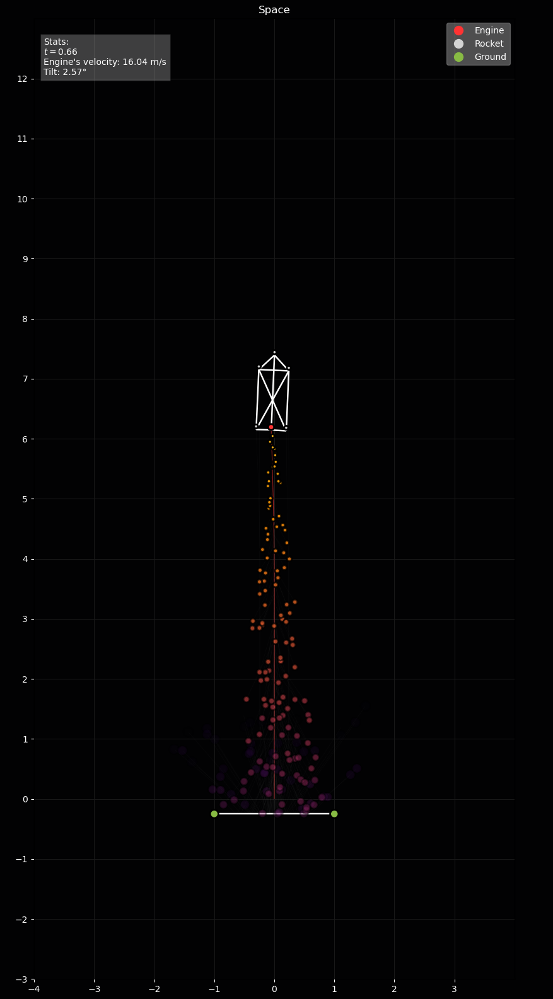

# Simulation of a solar system


## Run the simulation
To run the simulation, first make sure the environment is correctly installed. A demo is inside the main package.

## Requirements

The following python modules are needed to run the project

- [Anaconda](https://docs.anaconda.com/anaconda/install/index.html) (Optional but recommended)

- [Python 3.8.13](https://www.python.org/downloads/release/python-3813/)

- [NumPy](https://numpy.org)

    ```$conda install numpy```

- [Matplotlib](https://matplotlib.org/)

    ```$conda install matplotlib```


## Content

### Rocket Launch
#### Simulation location
``` ./main/rocket_launch.py ```
#### Simulation details
This simulation uses models for Earth gravity, Mass-Spring system, a ground collision, and particle emitter.
The particle emitter models the particles emitter from the engine. Each particle emitted gives the engine an adjustable thrust force.
Hence, the total thrust force is the sum of all the particles emitted.
The Mass-spring system is used to deform the shape of the rocket. The Earth gravity, of course, pulls the rocket's parts towards it.
The ground can collide with the rocket's vertices if it falls on it.



You can edit the simulation parameters in the python script above.